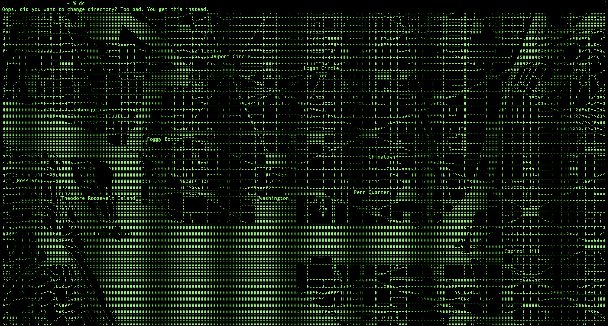

## 🟢 TerminalScriptDC 🟢
A terminal script for misspelling cd as dc.

# Instructions
Install dc.sh  
Open your terminal emulator  
Change to the directory where dc.sh is stored  
Type: chmod +x dc.sh  
Type: sudo mv dc.sh /usr/local/bin/dc  
Type: dc  
Enjoy!  
